# Deploying models with AWS Lambda + Docker

We’ll use AWS Lambda and Docker to deploy a Keras model

  -  You can find all the code here:
     [https://github.com/alexeygrigorev/aws-lambda-docker](https://github.com/alexeygrigorev/aws-lambda-docker)
  -  This tutorial is based on
     [https://github.com/alexeygrigorev/serverless-deep-learning](https://github.com/alexeygrigorev/serverless-deep-learning)
     and
     [https://github.com/alexeygrigorev/aws-lambda-model-deployment-workshop](https://github.com/alexeygrigorev/aws-lambda-model-deployment-workshop)
  -  We will deploy a model for predicting the types of clothes
     (trained here:
     [https://github.com/alexeygrigorev/mlbookcamp-code/blob/master/chapter-07-neural-nets/07-neural-nets-train.ipynb](https://github.com/alexeygrigorev/mlbookcamp-code/blob/master/chapter-07-neural-nets/07-neural-nets-train.ipynb))

Plan:

  - Convert the model from Keras to TF Lite
  - Prepare the code for lambda
  - Package everything into a Docker image
  - Push the image to ECR
  - Create the lambda function
  - Create an API Gateway

**Prerequisites**

  -  You need to have Python 3.7 (or Python 3.8). The easiest way to
     install it — use Anaconda
     ([https://www.anaconda.com/products/individual](https://www.anaconda.com/products/individual))
  -  Install TensorFlow (pip install tensorflow should be sufficient)
  -  Make sure you have Docker
  -  You need to have an account in AWS and AWS CLI installed and
     configured

## Preparing the model

Suppose we already trained a model using Keras. Now we want to serve it
with AWS Lambda. We need to convert the model to TF-lite format

Get the model:

```bash
wget
https://github.com/alexeygrigorev/mlbookcamp-code/releases/download/chapter7-model/xception_v4_large_08_0.894.h5
```

Create a python script “keras_to_tf.py”. Start with the imports:

```python
import numpy as np
import tensorflow as tf
from tensorflow import keras
```

Load the model:

```python
model = keras.models.load_model('xception_v4_large_08_0.894.h5')
```


Load the model:

```python
model = keras.models.load_model('xception_v4_large_08_0.894.h5')
```

Convert it to TF-Lite:

```python
converter = tf.lite.TFLiteConverter.from_keras_model(model)

tflite_model = converter.convert()

with tf.io.gfile.GFile('clothing-model-v4.tflite', 'wb') as f:
    f.write(tflite_model)
```

## Preprocessing functions

To apply the model, we need to do the following steps:

  -  Get the image (as a PIL Image)
  -  Prepare the image (resize, etc)
  -  Convert the image to a tensor, apply the pre-processing function
     (normalization, etc)
  -  Put the tensor in the model, get the predictions and post-process
     the predictions

In Keras, the logic for doing most of these operations is in the
keras-preprocessing module. We can’t use this module inside AWS Lambda
(it’s too heavy).

There’s a library called [“keras_image_helper”](https://github.com/alexeygrigorev/keras-image-helper) that has this logic

```bash
pip install keras_image_helper
```

Let’s use it:

```python
from keras_image_helper import create_preprocessor

preprocessor = create_preprocessor('xception', target_size=(299, 299))

image_url = 'http://bit.ly/mlbookcamp-pants'
X = preprocessor.from_url(image_url)
```

Now let’s use this code for getting the predictions\!

## Loading the model

To use the model, we first need to load it with TF lite:

```python
# import tensorflow.lite as tflite # if testing locally
import tflite_runtime.interpreter as tflite 

model_local_path = 'clothing-model-v4.tflite'

interpreter = tflite.Interpreter(model_path=model_local_path)
interpreter.allocate_tensors()

input_details = interpreter.get_input_details()
input_index = input_details[0]['index']

output_details = interpreter.get_output_details()
output_index = output_details[0]['index']
```

Now we can use it:

```python
interpreter.set_tensor(input_index, X)
interpreter.invoke()

preds = interpreter.get_tensor(output_index)
```

The preds array contains the predictions


## Code for Lambda

Each lambda function should have an entrypoint. Let’s create it:

```python
def lambda_handler(event, context):
    url = event['url']
    X = preprocessor.from_url(url)
    preds = predict(X)
    results = decode_predictions(preds)
    return results
```

The `predict` function is just the code from the previous sections put
together

```python
def predict(X):
    interpreter.set_tensor(input_index, X)
    interpreter.invoke()

    preds = interpreter.get_tensor(output_index)
    return preds[0]
```


The `decode_prediction` function turn the raw output into the final
result:

```python
labels = [
    'dress',
    'hat',
    'longsleeve',
    'outwear',
    'pants',
    'shirt',
    'shoes',
    'shorts',
    'skirt',
    't-shirt'
]

def decode_predictions(pred):
    result = {c: float(p) for c, p in zip(labels, pred)}
    return result
```

We put all this code in `lambda_function.py` (see [the full example](lambda_function.py)).

## Preparing the Docker image

Now we need to prepare a Docker image with all the dependencies. Let’s
create it:

```docker
FROM public.ecr.aws/lambda/python:3.7

RUN pip3 install --upgrade pip

RUN pip3 install keras_image_helper --no-cache-dir
RUN pip3 install https://raw.githubusercontent.com/alexeygrigorev/serverless-deep-learning/master/tflite/tflite_runtime-2.2.0-cp37-cp37m-linux_x86_64.whl --no-cache-dir

COPY clothing-model-v4.tflite clothing-model-v4.tflite
COPY lambda_function.py lambda_function.py

CMD [ "lambda_function.lambda_handler" ]
```


Note that we use a version of TF-Lite compiled for AWS Lambda. (Use
instructions from
[here](https://github.com/alexeygrigorev/serverless-deep-learning)
to compile it yourself for other versions of Python)

Let’s build this image:

```bash
docker build -t tf-lite-lambda .
```

Next, we need to check that the lambda function works.

Let’s run the image:

```bash
docker build -t tf-lite-lambda .
```

And test it with curl:

```bash
URL="http://localhost:8080/2015-03-31/functions/function/invocations"

REQUEST='{
    "url": "http://bit.ly/mlbookcamp-pants"
}'

curl -X POST \
    -H "Content-Type: application/json" \
    --data "${REQUEST}" \
    "${URL}" | jq
```

We should see the predictions:

```json
{
  "dress": -1.8682900667190552,
  "hat": -4.7612457275390625,
  "longsleeve": -2.3169822692871094,
  "outwear": -1.062570571899414,
  "pants": 9.88715648651123,
  "shirt": -2.8124303817749023,
  "shoes": -3.66628360748291,
  "shorts": 3.2003610134124756,
  "skirt": -2.6023387908935547,
  "t-shirt": -4.835044860839844
}
```

Now create an ECR:

```bash
aws ecr create-repository --repository-name lambda-images
```

And push the image there:

```bash
ACCOUNT=XXXXXXXXXXXX

docker tag tf-lite-lambda ${ACCOUNT}.dkr.ecr.eu-west-1.amazonaws.com/lambda-images:tf-lite-lambda

$(aws ecr get-login --no-include-email)

docker push ${ACCOUNT}.dkr.ecr.eu-west-1.amazonaws.com/lambda-images:tf-lite-lambda
```

It’s pushed! Now we can use it to create a lambda

## Creating the Lambda function

Create a lambda function. Go to services, select “Lambda”. Click “Create
function”. Select “Container image”.


Fill in the details. Container image URI should be the image we created
earlier and pushed to ECR:
“\<ACCOUNT\>.dkr.ecr.eu-west-1.amazonaws.com/lambda-images:tf-lite-lambda”.

You can also use “Browse images” to find it.


In execution role, choose “Create a new role with basic Lambda
permissions”


Click “create function”. Now we have a function\!

## Using the lambda function

Go to the Lambda function. Adjust the basic settings. Click edit:

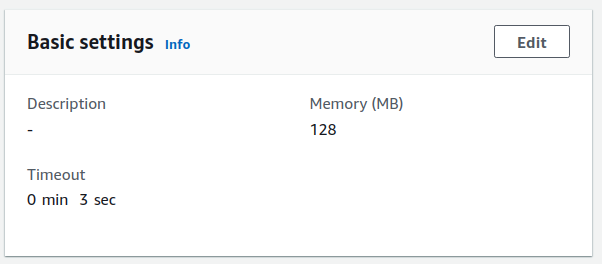

Give it 512MB or 1024MB of RAM and set timeout to 30 sec:


Save it.

Next, create a test with this request:

```json
{
  "url": "http://bit.ly/mlbookcamp-pants"
}
```

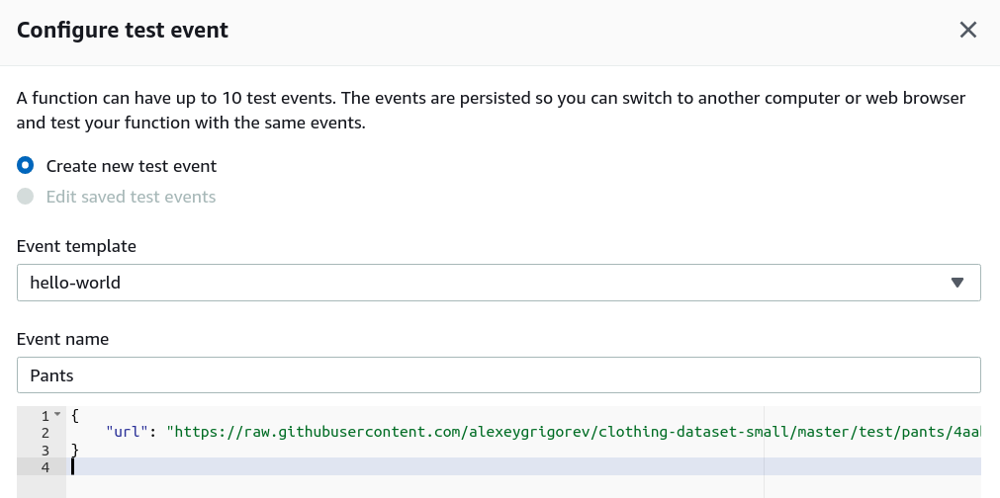

Save and test it: click the “test” button.

You should see “Execution results: succeeded”:

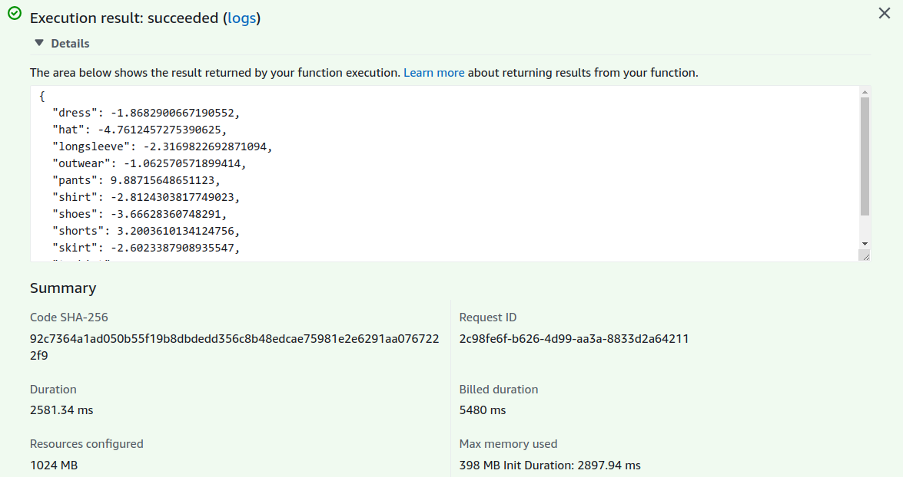

To be able to use it from outside, we need to create an API. We do it
with API Gateway.

## Creating the API Gateway

Go to services ⇒ API Gateway

Create a new HTTP API:

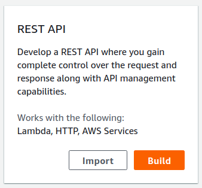

Call it “image-classification”

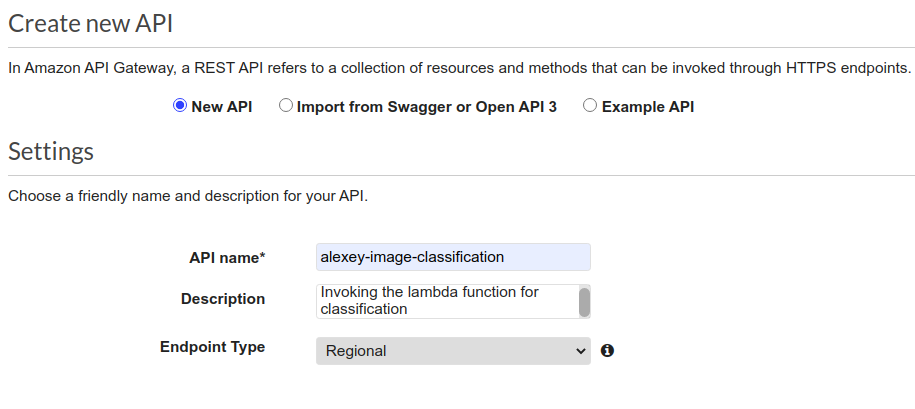

Then, create a resource “predict”, and create a method POST in this
resource:

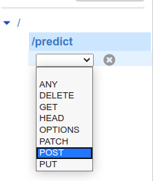

Select “Lambda” and enter the details of your lambda function:

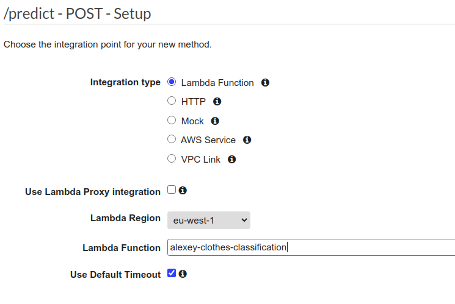Make sure you don’t select “proxy integration” —
this box should remain unchecked.

Now you should see the integration:

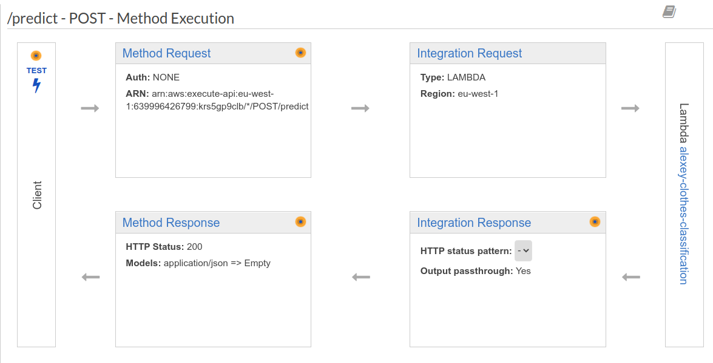

To test it, click on “test” and put this request to request body:

```json
{
"url": "http://bit.ly/mlbookcamp-pants"
}
```

You should get the response:

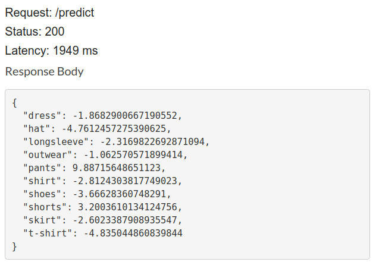

To use it, we need to deploy the API. Click on “Deploy API” from
Actions.

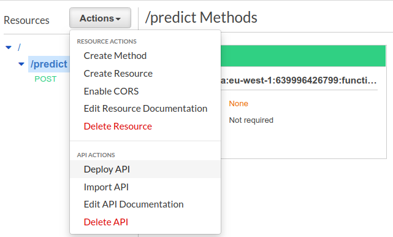

Create a new stage “test”:

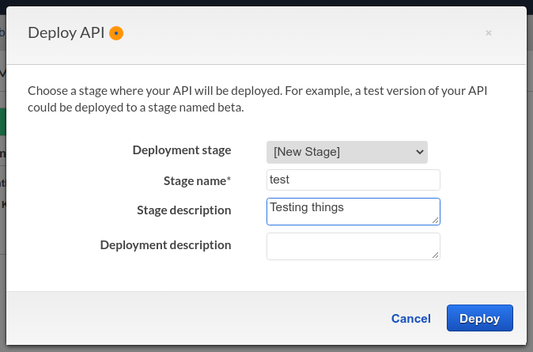

And get the url in from the “Invoke URL” field. For us, it’s
[https://l7avw579a1.execute-api.eu-west-1.amazonaws.com/test](https://l7avw579a1.execute-api.eu-west-1.amazonaws.com/test)

Now we can test it from the terminal:

```bash
URL="https://l7avw579a1.execute-api.eu-west-1.amazonaws.com/test"

REQUEST='{
    "url": "http://bit.ly/mlbookcamp-pants"
}'

curl -X POST \
    -H "Content-Type: application/json" \
    --data "${REQUEST}" \
    "${URL}"/predict | jq
```


The response:

```json
{
  "dress": -1.8682900667190552,
  "hat": -4.7612457275390625,
  "longsleeve": -2.3169822692871094,
  "outwear": -1.062570571899414,
  "pants": 9.88715648651123,
  "shirt": -2.8124303817749023,
  "shoes": -3.66628360748291,
  "shorts": 3.2003610134124756,
  "skirt": -2.6023387908935547,
  "t-shirt": -4.835044860839844
}
```

Now it’s working!